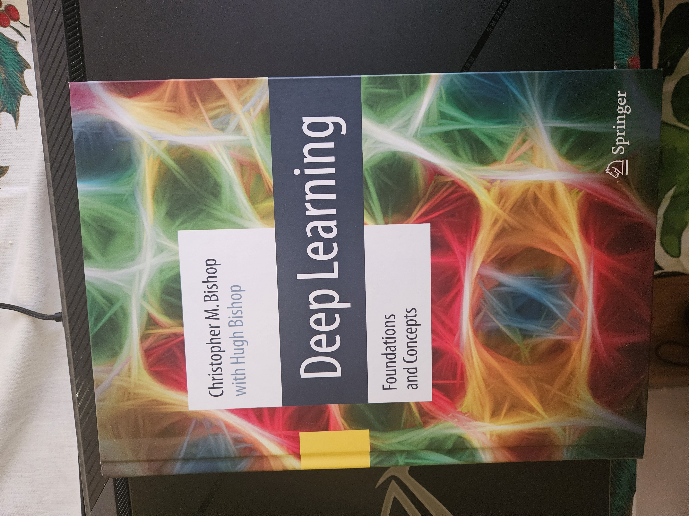

# ML_journey
This will be my own journey of learning to be better at ML. This is meant to encourage me to learn and build more often.
my [2d resume is here](https://kevorksulahian.github.io/2d-portfolio/)

* The [`C`](./C) folder in this directory is for the [cc4e.com](https://cc4e.com) class. More coming soon.

* The [`Karapathy`](./Karapathy) folder is for the Karapathy learning videos.

* And I am doing my experiments in the [`Random Code`](./random_code/) folder I will try to add more explanations once I have them. venv will probably be missing for most of them 😊.

## Completed projects/cpde

- [FinMAs](https://github.com/KevorkSulahian/agentic-llm-for-better-results)
- [Byte Latent mini implemntation](./Karapathy/GPT_from_scratch/BLT.ipynb), mine has a static patches 4 bites each.
- [NeoFetch](./random_code/neofetch/README.md) yes i use windows :/
- [Karapathy minbpe](https://github.com/karpathy/minbpe) done [here](./Karapathy/GPT_from_scratch/token.ipynb)
- I have older stuff but I'm still too lazy to add them

## Things I'm working on right now
- [FinMAs](https://github.com/KevorkSulahian/agentic-llm-for-better-results) working (slowly) on adding vision and updating the crew to work with flow
- [Learning C cc4e](https://www.cc4e.com/)
- [I will need to pour my life into this](https://x.com/rasbt/status/1790007260615217156)
- [neetcode a day keeps the unemployment away](https://neetcode.io/courses)
- Also reading  it's a new theoretical reintro to the math and theory
- [deep ml exercises](https://www.deep-ml.com/)
- [nand game](https://nandgame.com/)
- [puzzles](https://www.cs.cmu.edu/puzzle/)
- [A long list of open problems and concrete projects in evals](https://docs.google.com/document/d/1gi32-HZozxVimNg5Mhvk4CvW4zq8J12rGmK_j2zxNEg/edit?pli=1&tab=t.0#heading=h.q14pjbvzx1x)

### Self-improvement guides
- [write better code](https://marvelousmlops.substack.com/p/bridging-the-gap-converting-data)
- [Document your grind](https://lelouch.dev/blog/august-2024/documenting-your-grind/)
- [Reclaiming your attention and focus - Unc advice for the world](https://x.com/LukasHozda/status/1860442337534468333)
- [Machine Learning Interviews
](https://huyenchip.com/machine-learning-systems-design/toc.html)
- [LLM (ML) Job Interviews (Fall 2024) - Process](https://mimansajaiswal.github.io/posts/llm-ml-job-interviews-fall-2024-process/)

## Completed stuff that I recommend
- [Reward Hacking](https://lilianweng.github.io/posts/2024-11-28-reward-hacking/) what could go wrong in RLHF
- [LLM tuning and alignment series by HF](https://argilla.io/blog/mantisnlp-rlhf-part-8/) Explains different techniques
- [What We’ve Learned From A Year of Building with LLMs](https://applied-llms.org/) Guide to building llms from exp
- [Byte Latent Transformer: Patches Scale Better
Than Tokens](https://arxiv.org/pdf/2412.09871) instead of a single byte, they use patches, which could scale better with images in the future
- [High-Quality Human Data](https://lilianweng.github.io/posts/2024-02-05-human-data-quality/) How human data is made, based on what I do daily, this is a helpful read. It's not always about the model...
- [The Illustrated DeepSeek-R1](https://newsletter.languagemodels.co/p/the-illustrated-deepseek-r1)
- [A vision researcher’s guide to some RL stuff: PPO & GRPO](https://yugeten.github.io/posts/2025/01/ppogrpo/)
- [understanding-multimodal-llms](https://magazine.sebastianraschka.com/p/understanding-multimodal-llms)
- I highly recommend the [A vision researcher’s guide to some RL stuff](https://yugeten.github.io/posts/2025/01/ppogrpo/) for its simplicity
- [AI progress visualized](https://theaidigest.org/progress-and-dangers), it's a really fun read.
- [The State of Reinforcement Learning for LLM Reasoning - 2025](https://magazine.sebastianraschka.com/p/the-state-of-llm-reasoning-model-training?utm_campaign=post) would be worth to go over the papers at the end one more time.
- [Sabotage Evaluations for Frontier Models](https://arxiv.org/pdf/2410.21514) Great paper on evals
- [KL Divergence](https://www.countbayesie.com/blog/2017/5/9/kullback-leibler-divergence-explained)
- [Momentum](https://distill.pub/2017/momentum/)
- [BroadCasting](https://numpy.org/doc/stable/user/basics.broadcasting.html) how python works
- [Singular Vector Decomposition](https://gregorygundersen.com/blog/2018/12/10/svd/)
- [GRPO Video explenation](https://youtu.be/XeUB4h1OO1g?si=UwQiG3az286G4b1c)
- [Visual info](https://colah.github.io/posts/2015-09-Visual-Information/) pretty decent article would read again.

## Completed Courses/projects
- [HF smol course](https://github.com/huggingface/smol-course). Small but super nice intro to using HF finetuning and more.
- [learnpytorch.io mostly following and not much else](https://www.learnpytorch.io/).
- [hf agents](https://huggingface.co/learn/agents-course)

## To do in the future

#### Blogs
##### Blog writers
- [ML Blogs](https://cneuralnets.netlify.app/mlblogs)
- [hackerllama](https://osanseviero.github.io/hackerllama/blog/)
- [eugeneyan](https://eugeneyan.com/start-here/)

##### Just a blog
- [GNN intro](https://distill.pub/2021/gnn-intro/)
- [Understanding Multimodal LLMs](https://magazine.sebastianraschka.com/p/understanding-multimodal-llms)
- [Physics of Language Models](https://antaripasaha.notion.site/Physics-of-Language-Models-understanding-hidden-reasoning-process-1045314a563980c68566e4ecc1e32ef6)
- [Policy Gradient](https://lilianweng.github.io/posts/2018-04-08-policy-gradient/)
- [Flash Attention](https://benjaminwarner.dev/2023/08/16/flash-attention-compile)
- [LLM visualized](https://bbycroft.net/llm)
- [LLM training](https://rentry.org/llm-training)
- [LLM Research Insights:](https://magazine.sebastianraschka.com/p/llm-research-insights-instruction?)
- [FineWeb: decanting the web for the finest text data at scale](https://huggingface.co/spaces/HuggingFaceFW/blogpost-fineweb-v1)
- [torch.compile, the missing manual](https://docs.google.com/document/d/1y5CRfMLdwEoF1nTk9q8qEu1mgMUuUtvhklPKJ2emLU8/edit?tab=t.0#heading=h.66t0x3z84jio)
- [Build a GENAI platform](https://huyenchip.com/2024/07/25/genai-platform.html)
- [New LLM Pre-training and Post-training Paradigms](https://magazine.sebastianraschka.com/p/new-llm-pre-training-and-post-training)

#### Books and math
- [Mathematics for Machine Learning](https://mml-book.github.io/)
- [Applied Linear Algebra Notes](https://docs.google.com/document/d/1uvAbEhbgS_M-uDMTzmOWRlYxqCkogKRXdbKYYT98ooc/edit?tab=t.0#heading=h.lxp3eg9lr5k9)
- [MAT3341 Applied Linear Algebra](https://alistairsavage.ca/mat3341/notes/MAT3341-Applied_Linear_Algebra.pdf)
- [Introduction to Linear Algebra](https://pabloinsente.github.io/intro-linear-algebra)
- [Financial analysis book](https://github.com/realmistic/PythonInvest-basic-fin-analysis)
- [Graphic data science](https://geographicdata.science/book/intro.html)
- [THE HUNDRED-PAGE LANGUAGE MODELSBOOK](https://thelmbook.com/)
- [Building Blocks for theoretical computer science](https://mfleck.cs.illinois.edu/building-blocks/index-sp2020.html)
- [Foundation of LLMS](https://www.alphaxiv.org/abs/2501.09223)
- [AI Engineering](https://www.oreilly.com/library/view/ai-engineering/9781098166298/)

#### C and cuda
- [Stanford CS Library](http://cslibrary.stanford.edu/101/)
- [Beej's Guide to C Programming](https://beej.us/guide/bgc/)
- [How to Optimize a CUDA Matmul Kernel](https://siboehm.com/articles/22/CUDA-MMM)
    - [code](https://github.com/ridgerchu/matmulfreellm)
- [From Scratch series](https://biraj21.github.io/blogs/from-scratch.html)
- [LLM.c](https://github.com/karpathy/llm.c?tab=readme-ov-file)
- [PMPP-notes](https://github.com/loganwatchorn/notes-pmpp)
- [my weak parralel guide](https://rebel-sushi-cd7.notion.site/PipeGoose-starter-ecc431cf9b7242d6bf933eac2a83b766)
- [GPU MODE](https://github.com/gpu-mode)
- [BIRDS cohort](https://sites.google.com/cohere.com/c4ai-community/community-programs/birds?authuser=0)
- [GPU Glossary](https://modal.com/gpu-glossary)
- [C and Unix course](https://github.com/darrelllong/CSE-13S)
#### Papers
- [VLM's are blind](https://vlmsareblind.github.io/)
- [Mamba the hard way](https://srush.github.io/annotated-mamba/hard.html?utm_source=substack&utm_medium=email)
- [LORA](https://arxiv.org/abs/2106.09685)
- [1-bit LLM](https://arxiv.org/abs/2402.17764)
- [XLSTM](https://arxiv.org/abs/2405.04517)
- [Scalable MatMul-free Language Modeling](https://arxiv.org/abs/2406.02528)
- [Trading GPT](https://arxiv.org/pdf/2309.03736)
- [Titans : learning to memorize at test time](https://www.alphaxiv.org/abs/2501.00663)
- [Transformers^2](https://www.alphaxiv.org/abs/2501.06252)
- [LLM research 2024](https://sebastianraschka.com/blog/2025/llm-research-2024.html)

#### Codes to implelement
- [Cohere agents](https://github.com/cohere-ai/notebooks/tree/main?tab=readme-ov-file#agents)
- [Building A GPT-Style LLM Classifier From Scratch By Sebastian](https://magazine.sebastianraschka.com/p/building-a-gpt-style-llm-classifier?)
- [lora from scratch by Sebastian](https://lightning.ai/lightning-ai/studios/code-lora-from-scratch?view=public&section=featured)
- [try comet in case for job](https://lightning.ai/comet/studios/comet-lightning-quickstart?section=featured&view=public&query=comet)
- [llama from scratch](https://github.com/naklecha/llama3-from-scratch)
- [lightning snippets](https://lightning.ai/studios?section=featured)
- [DPSY](https://lightning.ai/lightning-ai/studios/dspy-programming-with-foundation-models?view=public&section=all)
- [Use and play the mini LLM boiii](https://github.com/jingyaogong/minimind/?tab=readme-ov-file)
- [HF TRL library](https://huggingface.co/docs/trl/index)
- [HF Open-R1](https://github.com/huggingface/open-r1)

#### YouTube videos and channels
##### Channel
-[Code in a jiffy](https://www.youtube.com/@codeinajiffy)
##### Video or series
- [Writing a C interpreter series](https://www.youtube.com/playlist?list=PLbxut1xyrkCZ-9d_03G0KBU4uh782J1eN)
- [Deep Gen models](https://www.youtube.com/@prathoshap5226/playlists)
#### Courses
##### High Importance
- [LLM uni course](https://cocoxu.github.io/CS8803-LLM-fall2024/calendar/)
- [CS300](https://cs.brown.edu/courses/csci0300/2024/schedule.html)
- [GENAI cours UNI](https://github.com/raminmohammadi/GEN-AI/tree/main?tab=readme-ov-file)
- [C and Unix programming](https://github.com/darrelllong/CSE-13S)

##### else
- [HF Deep RL](https://huggingface.co/learn/deep-rl-course/unit0/introduction)
- [RL an overview](https://arxiv.org/pdf/2412.05265)
- [Stanford RL](https://web.stanford.edu/class/cs234/CS234Spr2024/modules.html)
- [NLP Course](https://www.nlpdemystified.org/course)
- [Advanced NLP](https://cmu-l3.github.io/anlp-spring2025/#details)
- 

#### IRL books 

## my articles
### Note: some of the articles are basically implementation of tutorials so not fully mine
- [Financial Analysis With Langchain and Crewai](https://huggingface.co/blog/herooooooooo/financial-analysis-with-langchain-and-crewai) some testing from langchain and crewai docs
- [Automate Job Applications](https://huggingface.co/blog/herooooooooo/automation-job-applications-with-python-and-ollama) auto-rejection deserves auto-apply
- [FineTune Clip](https://medium.com/@kevork.ysulahian/finetune-clip-with-huggingface-2f0abc23c57c)
- [Zero-shot Classification](https://medium.com/@kevork.ysulahian/zero-shot-classification-and-detection-made-simple-with-huggingface-000d63d53bfe)
- [Data Scrapping project with R](https://medium.com/@kevork.ysulahian/real-life-data-scrapping-project-scrapping-job-postings-with-r-47a6091f4866)
- [My First C project](https://huggingface.co/blog/herooooooooo/c-first-project)

## Maybe things

### Courses
- [parallel computing](https://gfxcourses.stanford.edu/cs149/fall24/courseinfo)
- [harvard research class](https://docs.google.com/document/d/1uvAbEhbgS_M-uDMTzmOWRlYxqCkogKRXdbKYYT98ooc/edit?pli=1&tab=t.0#heading=h.o3hogvl0ayc1)
- [ML Engineering](https://github.com/stas00/ml-engineering)
- [Financial RL](https://github.com/AI4Finance-Foundation/FinRL/tree/c34190153d84c376dcacaf18b57097a6272b0286)
- [Open AI RL](https://spinningup.openai.com/en/latest/)

### Code
- [video tracking](https://github.com/roboflow/supervision)
- [dspy rag](https://www.kaggle.com/code/iamleonie/rag-with-gemma-on-hf-and-weaviate-in-dspy)
- [Write your Own Virtual Machine](https://www.jmeiners.com/lc3-vm/)

- [Competitive Programmer’s Handbook](https://cses.fi/book/book.pdf)
- [HPC](https://en.algorithmica.org/hpc/complexity/)
- [What Every Programmer Should Know About Memory](https://people.freebsd.org/~lstewart/articles/cpumemory.pdf)

