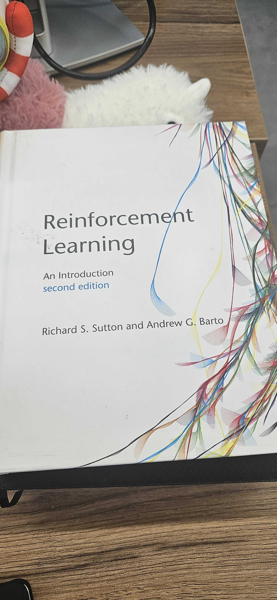

# Roadmap

This is the structured version of the old "to do / maybe" lists.
It is split by outcomes so it reads more like a technical growth plan than a bookmark dump.

## Reading / Research Queue (Curated)

### Core blogs / writers

- [ML Blogs](https://cneuralnets.netlify.app/mlblogs)
- [hackerllama](https://osanseviero.github.io/hackerllama/blog/)
- [eugeneyan](https://eugeneyan.com/start-here/)

### Topics I want to cover

- [GNN intro](https://distill.pub/2021/gnn-intro/)
- [Understanding Multimodal LLMs](https://magazine.sebastianraschka.com/p/understanding-multimodal-llms)
- [Policy Gradient](https://lilianweng.github.io/posts/2018-04-08-policy-gradient/)
- [Flash Attention](https://benjaminwarner.dev/2023/08/16/flash-attention-compile)
- [FineWeb](https://huggingface.co/spaces/HuggingFaceFW/blogpost-fineweb-v1)
- [torch.compile (missing manual)](https://docs.google.com/document/d/1y5CRfMLdwEoF1nTk9q8qEu1mgMUuUtvhklPKJ2emLU8/edit?tab=t.0#heading=h.66t0x3z84jio)
- [Build a GenAI platform](https://huyenchip.com/2024/07/25/genai-platform.html)

## Ideas

- [Stanford CS149 (parallel computing)](https://gfxcourses.stanford.edu/cs149/fall24/courseinfo)

### LLM

#### LLM from Scratch

- [This Guide from LLM from scartch](https://x.com/rasbt/status/1790013057659183601) need to add the book here later.
- [Stanford CS336 Language Modeling from Scratch](https://www.youtube.com/playlist?list=PLoROMvodv4rOY23Y0BoGoBGgQ1zmU_MT_)
- [UnSloth Intro to finetunning](https://unsloth.ai/docs/get-started/fine-tuning-for-beginners)
- [RLHF Book](https://livebook.manning.com/book/the-rlhf-book/welcome/)

#### Others
- [Build your own Copilot](https://prvn.sh/build-your-own-github-copilot/)
- [DSPY RAG](https://towardsdatascience.com/how-to-build-your-own-custom-llm-memory-layer-from-scratch/)
- [QED-Nano: Teaching a Tiny Model to Prove Hard Theorems
](https://huggingface.co/spaces/lm-provers/qed-nano-blogpost)
- [Post training 101](https://tokens-for-thoughts.notion.site/post-training-101)
- [The Smol Training Playbook:
The Secrets to Building World-Class LLMs](https://huggingface.co/spaces/HuggingFaceTB/smol-training-playbook)

### RL
#### Papers todo in this order:
- [Proximal Policy Optimization Algorithms](https://arxiv.org/abs/1707.06347)
- [Generalized Advantage Estimation for Distributional Policy Gradients](https://arxiv.org/abs/2507.17530)
- [Playing Atari with Deep Reinforcement Learning](https://arxiv.org/abs/1312.5602)
- [AlphaStar](https://deepmind.google/blog/alphastar-mastering-the-real-time-strategy-game-starcraft-ii/)
- [Learning Dexterous In-Hand Manipulation](https://arxiv.org/abs/1808.00177)
- [Emergent Tool Use From Multi-Agent Autocurricula](https://arxiv.org/abs/1909.07528)
- [Capture The Flag](https://deepmind.google/blog/capture-the-flag-the-emergence-of-complex-cooperative-agents/)
#### Book
- 

#### Hands on Coding
- [RL UnSloth Guide](https://unsloth.ai/docs/get-started/reinforcement-learning-rl-guide)
- [FinRL](https://github.com/AI4Finance-Foundation/FinRL/tree/c34190153d84c376dcacaf18b57097a6272b0286)
- [OpenAI Spinning Up (RL)](https://spinningup.openai.com/en/latest/)

#### Courses
- [HF Course](https://huggingface.co/learn/deep-rl-course/en/unit0/introduction)

### Cuda, Parallelism, and GPUs

- [intro to cuda for programmers](https://www.pyspur.dev/blog/introduction_cuda_programming)
- [The Ultra-Scale Playbook:
Training LLMs on GPU Clusters](https://huggingface.co/spaces/nanotron/ultrascale-playbook)
- [Basic facts about GPUs](https://damek.github.io/random/basic-facts-about-gpus/)
- [Cuda course](https://github.com/Infatoshi/cuda-course)

### MLE

#### Book
- [Harvard CS 249](https://github.com/harvard-edge/cs249r_book)
- [STAT 4830: Numerical Optimization for Data Science and Machine Learning](https://damek.github.io/STAT-4830/toc.html)
#### Course
- [TinyTorch](https://mlsysbook.ai/tinytorch/getting-started.html)

### Cloud
#### AWS
- [AWS Project ToolKit](https://yourclouddude.gumroad.com/l/ieexsy?layout=profile)
    - [Full Version](https://decisive-busby-f78.notion.site/AWS-Project-Toolkit-23487b3fcaea8081a64effc9634cc62c)
- [Cloud Launchpad: AWS Essentials](https://yourclouddude.gumroad.com/l/exunef?layout=profile)

### Other
- [🍷 FineWeb: decanting the web for the finest text data at scale](https://huggingface.co/spaces/HuggingFaceFW/blogpost-fineweb-v1) Learning to Create a Dataset.
- [Fluent Python Clear, Concise, and Effective Programming](https://elmoukrie.com/wp-content/uploads/2022/05/luciano-ramalho-fluent-python_-clear-concise-and-effective-programming-oreilly-media-2022.pdf) for better Python skills
- [Write your own VM](https://www.jmeiners.com/lc3-vm/)
- [Algorithmica HPC](https://en.algorithmica.org/hpc/complexity/)
- [What Every Programmer Should Know About Memory](https://people.freebsd.org/~lstewart/articles/cpumemory.pdf)
- [Computer Networking Fundamentals For Developers, DevOps, and Platform Engineers](https://labs.iximiuz.com/courses/computer-networking-fundamentals) Course
- [Reachy Mini one day perhaps](https://pollen-robotics-reachy-mini.hf.space/)
- [Deep Learning for Molecules](https://dmol.pub/)
- [Flow Matching And Diffusion model](https://diffusion.csail.mit.edu/2026/docs/lecture_notes.pdf)
    - [Lab](https://github.com/eje24/iap-diffusion-labs)

## Maintenance Rule for This File

- Keep this page focused on what changes career direction or project quality.
- Move casual bookmarks into a separate personal list if they are not actionable.
