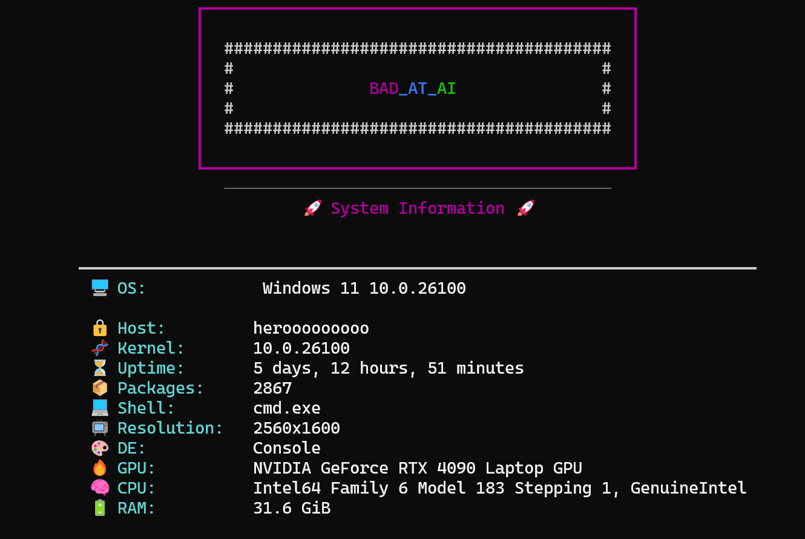

# Neofetch Clone

This script gathers and displays system information in a visually appealing format using the `rich` library. It provides details such as the operating system, host name, kernel version, uptime, number of installed packages, shell, screen resolution, desktop environment, GPU, CPU, and RAM.

## Features

- Displays system information in a table format
- Includes a custom logo
- Uses `rich` for styling and formatting

## Example Output



## How to Run

1. Ensure you have the required dependencies installed:
    ```sh
    pip install -r requirements.txt
    ```

2. Run the script:
    ```sh
    python main.py
    ```

## Dependencies

- `psutil`
- `screeninfo`
- `rich`
- `distro`
